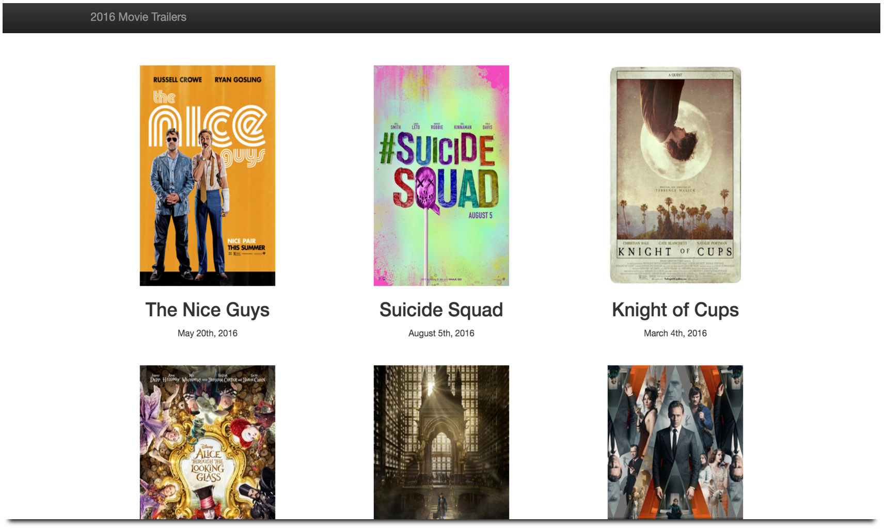

##2016 Movie Trailers

A simple server side application that stores a list of 2016 movies with it's poster, trailer and release date.

###Demo:
[Click Here](http://samurairanderson.github.io/Movie-Trailers/)

###Requires:
[Python 2.7](https://www.python.org/download/releases/2.7/)

###Running this program:
Cole this repo: 
`$ git clone https://` 
`$ cd Movie_Trailers` 
Execute this script: 
`$ python entertainment_center.py`

